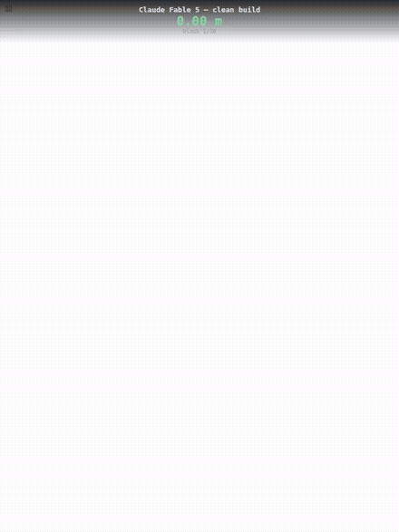

# TowerBench

**Which LLM builds the tallest tower?** — a physical-reasoning benchmark for language models: place blocks through a small SDK, under placement uncertainty, in a deterministic physics sim.

<table>
  <tr>
    <td width="50%"></td>
    <td width="50%"></td>
  </tr>
  <tr>
    <td align="center"><em>The same model, attempt 2: a clean 7.3m build.</em></td>
    <td align="center"><em>Attempt 1: 7.9m — then block 13 brings it all down. It rebuilds to 4.0m from the rubble.</em></td>
  </tr>
</table>

## Results — benchmark `main-1` (Aug 2026)

Challenge `pillarsxl`: 30 blocks (14 pillars, 10 lintels, 6 cubes), 5 seeds ×
3 attempts per model, episodic mode. **Score = mean over seeds of the
best-of-3 final standing height.**

| # | model | height (m) | ±σ | tallest | attempt 1→2→3 (mean) | output tokens |
|---|-------|-----------|-----|---------|----------------------|---------------|
| 1 | Claude Opus 5 | **8.52** | 2.4 | 11.07 | 6.50 → 6.85 → 8.10 | 390k |
| 2 | Claude Sonnet 5 | **8.46** | 2.2 | 11.94 | 6.30 → 5.54 → 4.84 | 396k |
| 3 | Claude Fable 5 | **7.81** | 1.0 | 9.10 | 6.45 → 4.01 → 5.98 | 284k |
| 4 | GPT-5.5 | **7.79** | 0.3 | 7.92 | 5.59 → 7.06 → 6.90 | 99k |
| 5 | DeepSeek V4 Flash | **7.10** | 1.1 | 8.18 | 2.08 → 6.24 → 5.80 | 467k |
| 6 | GPT-5.6 Sol | **6.16** | 1.4 | 6.87 | 3.17 → 3.43 → 4.76 | 76k |
| 7 | GLM-5.2 | **5.91** | 2.6 | 8.83 | 2.98 → 5.08 → 5.91 | 376k |
| 8 | Kimi K3 | **4.77** | 1.3 | 6.88 | 1.64 → 4.32 → 4.25 | 256k |
| 9 | Claude Haiku 4.5 | **3.91** | 3.4 | 9.82 | 1.99 → 3.40 → 1.26 | 64k |
| 10 | GPT-5.4 mini | **1.79** | 0.4 | 2.40 | 1.38 → 1.11 → 1.68 | 31k |

Scripted naive baseline: **1.75 m**. Every replay in this table can be
re-simulated and watched (`replays/`, group `main-1` — see release assets).

### How it relates to other benchmarks

For eyeballing correlations only — external numbers are vendor/aggregator
reported, mixed configs, as of Aug 2026 (sources in the `main-1` release notes):

| model | TowerBench (m) | AA Intelligence Index | SWE-bench Verified | ARC-AGI-2 |
|-------|---------------|----------------------|--------------------|-----------|
| Claude Opus 5 | 8.52 | 61 | 96.0 | 90.4 |
| Claude Sonnet 5 | 8.46 | 53 | 82.1 | — |
| Claude Fable 5 | 7.81 | 60 | 95.0 | 89.2¹ |
| GPT-5.5 | 7.79 | 55 | 88.7 | 85.0¹ |
| DeepSeek V4 Flash | 7.10 | 50 | 79.0 | — |
| GPT-5.6 Sol | 6.16 | 59 | 96.2 | 92.5¹ |
| GLM-5.2 | 5.91 | 51 | —² | 22.8 |
| Kimi K3 | 4.77 | 57 | 93.4 | 60.4 |
| Claude Haiku 4.5 | 3.91 | 30 | 73.3 | 37.7¹ |
| GPT-5.4 mini | 1.79 | 40 | 73.0 | 18.9¹ |

¹ public-eval or aggregator figure, not ARC's semi-private set. ² Zhipu
publishes SWE-bench Pro only.

The interesting part is the *disagreement*: GPT-5.6 Sol and Kimi K3 are
top-tier on coding and reasoning suites but mid/low here — Sol repeatedly
built to 7.9 m and toppled its own tower (no stopping instinct, [#3](../../issues/3));
K3 locked a wrong physical assumption into its notes on attempt 1
([#2](../../issues/2), [#5](../../issues/5)). TowerBench seems to load on risk
calibration and physical judgment, not raw capability.

## The benchmark

Build the tallest tower you can by placing blocks through a
small SDK — under a position/velocity **uncertainty contract**. You can place a
block precisely, or control its velocity precisely, but not both:

```
sigmaX * sigmaV = K        (constant per challenge)

focus = 1   -> exact position, wild velocity (block may kick sideways at spawn)
focus = 0   -> exact velocity, wild position (block may appear off-target)
focus = 0.5 -> balanced      (sigmaX = sigmaX0, sigmaV = sigmaV0)
```

The requested velocity is the *mean* of the sampled velocity, so allocating
some focus to velocity lets an agent "press" a block gently into place instead
of gambling on a sideways kick — the trade-off is the benchmark's core skill.

Physics is simulated headlessly (rapier3d, deterministic with a seeded RNG).
three.js is a **viewer only** — replays re-simulate from
`(challengeId, seed, placement log)` with the same core code the scorer used.

## Quickstart

```sh
npm install
npm test                              # unit + determinism + scoring tests
npm run agent:naive -- --challenge bricks --seed 1   # scripted baseline, writes replays/
npm run dev                           # viewer -> http://localhost:5173/src/viewer/
```

The viewer loads `?replay=/replays/<file>.json` (defaults to the naive baseline
run). Play/pause, speed, and a scrub slider are at the bottom.

## Running LLM agents

```sh
npm run bench -- --model claude-fable-5 --challenge bricks --seeds 3x11
npm run bench -- --model gpt-5.6-sol  --challenge mixed --seeds 11,12,13
```

`--seeds 3x11` = three attempts on seed 11 (same seed across attempts measures
in-context improvement); `--seeds 11,12,13` = one attempt per seed. Models
starting with `claude` use the Anthropic API (`ANTHROPIC_API_KEY` /
`ANTHROPIC_API_KEY_PERSONAL`); everything else uses OpenAI-compatible chat
completions (`OPENAI_API_KEY`, `--base-url` for other providers).

`--mode episodic` (default) starts each attempt with a fresh conversation: when
an attempt ends the model distills what it learned into a persistent notebook
(`update_notebook`), the context resets, and the next attempt begins with only
the system prompt, the harness-kept history table, and that notebook — so the
live context stays ~10–15k tokens no matter how many attempts. `--mode session`
is the original single-conversation behavior, kept for comparison.

Provider knobs (env): `BENCH_HTTP_TIMEOUT_MS` (per-request timeout, default
300000) and `BENCH_MAX_TOKENS` (cap completion length) — both default off/unset
and exist for slow or non-terminating reasoning models (e.g. k3, whose server
can otherwise generate past every timeout on long planning turns).

`scripts/coverage.sh` runs a model × challenge coverage matrix in parallel
lanes (one concurrent run per model) — edit the lane lists to taste.

Per run the harness writes: one replay per attempt (viewable in the viewer), a
`run-<label>-<challenge>-<runId>.json` score summary (including mode and
notebook entries), and a full `transcript-*.json` of every turn. Attempts
auto-advance when the inventory is exhausted; the model can also abandon early
via `next_episode`.

## Layout

```
src/core/    authoritative headless sim (no DOM): physics, uncertainty, scoring
  types.ts       shared interfaces (blocks, placement API, challenges, replay)
  sim.ts         rapier world wrapper: step, settle detection, contact queries
  uncertainty.ts focus -> sigmas (sigmaX * sigmaV = K), Gaussian sampling
  episode.ts     validation -> sample -> simulate-to-settle -> replay log
  scoring.ts     tower height via contact chain to the ground
  challenges.ts  10 challenges: bricks, bricks50, bricks100, bricks50k2, bricks50k4, mixed, sparse, storm, pillars, slick
src/sdk/     what an agent (LLM or scripted) drives
  tools.ts       tool schemas (get_inventory / observe / place_block) + SDK_DOC
  utils.ts       spatial helpers (rotatedExtents, stackCenterY, footprint, ...)
  client.ts      EpisodeClient: typed wrapper + callTool dispatch
src/viewer/  three.js replay viewer (re-simulates replays, scrub playback)
src/agents/  naive.ts — scripted baseline agent, writes replays/*.json
tests/       vitest: rng, uncertainty contract, episode validation, determinism, scoring
```

## Placement API (summary)

```ts
place_block({
  blockId: 'b1',
  position: [0, 0.31, 0],   // desired center, meters, y-up
  yawDeg: 90,               // optional, default 0
  orientation: 'upright',   // optional named pose: box flat|side|upright, cylinder upright|flat
  quat: [0, 0, 0.7071, 0.7071], // optional full-resolution rotation (precedence over orientation/yaw)
  velocity: [0, -0.3, 0],   // optional desired MEAN velocity, |v| <= maxSpeed
  focus: 0.6,               // required: precision allocation, [0, 1]
})
// -> { ok, actual: { position, velocity, sigma: {x, v} },
//      settle: { outcome, tower, spawnOverlap, spawnPenetration, ... } }
// or { ok: false, error } — validation errors are retryable and free
```

Score = max top-y over blocks with a contact chain to the ground, after the
whole inventory settles. Peak height is tracked separately. Blocks that fall
off the ground plane are lost. Spawning inside another block is not an error —
physics resolves it (violently); the result reports `spawnOverlap`.

## Leaderboard

`http://localhost:5173/src/board/` lists every attempt (sortable, filterable by
challenge and group) with watch links into the viewer. It reads
`replays/index.json`, regenerated automatically after every run or via
`npm run board`. Tag related runs with `--group <name>` to compare them as a set.

## Status

Working: core sim, 10 challenges, SDK + spatial utilities, naive baseline agent,
replay viewer, LLM harness (episodic + session modes), leaderboard board. Full
model × challenge coverage matrix lives in `replays/` (group `cov-1`); known
tuning knobs (settle thresholds, per-challenge K) are listed as open decisions
in the project plan.

## License

MIT — see [LICENSE](LICENSE).

---

A [math vs vibes](https://mathvsvibes.com) project.
